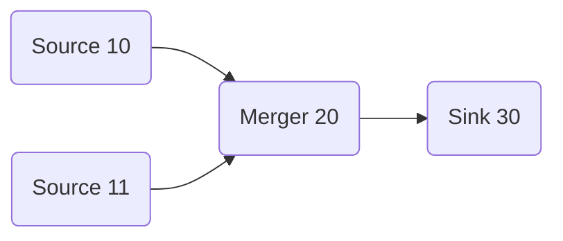

[](LICENSE)

# uGraph

Header‑only C++17 utilities for *static* direct acyclic graphs:

* `Topology` – compile‑time topological ordering & cycle detection (no storage, no allocations)
* `GraphView` – runtime traversal + minimal reusable buffer slot assignment

Single include:
```cpp
#include <ugraph.hpp>
```

---

## Topology

Provides compile‑time:
* Topological sorting
* Cycle detection
* Ordered visitation

### NodeTag

Pure type descriptor:

```cpp
NodeTag<ID, Payload, Priority = 0>
```

Encodes a stable integer ID plus a payload (module) type—no runtime object required.

Optional priority parameter:

* `Priority` (default `0`) is a compile-time tie-breaker used by ordering algorithms — larger values run earlier when multiple nodes are otherwise unordered.

### Link

```cpp
Link<Src, Dst>
```

Declares a dependency: `Src` must come before `Dst`. Collect links as template parameters of `Topology`.

### Example

Enforcing subsystem startup order at compile time:

```cpp
// Subsystems
struct Config    { static void init() { /* load config */ } };
struct Logger    { static void init() { /* needs Config */ } };
struct Database  { static void init() { /* needs Config + Logger */ } };
struct HttpServer{ static void init() { /* needs Database */ } };

// IDs
using config_t   = ugraph::NodeTag<1, Config>;
using server_t   = ugraph::NodeTag<2, HttpServer>;
using database_t = ugraph::NodeTag<3, Database>;
using logger_t   = ugraph::NodeTag<4, Logger>;

// Dependencies (Src -> Dst)
using AppTopo =
ugraph::Topology<
    ugraph::Link<config_t,   logger_t>,   // Config before Logger
    ugraph::Link<config_t,   database_t>, // Config before Database
    ugraph::Link<logger_t,   database_t>, // Logger before Database
    ugraph::Link<database_t, server_t>    // Database before Server
>;

static_assert(!AppTopo::is_cyclic());
constexpr auto order = AppTopo::ids(); // e.g. {1,4,3,2}
static_assert(AppTopo::size() == 4);

// Execute in safe order
AppTopo::apply([](auto... tag){
    (decltype(tag)::module_type::init(), ...);
});
```

### Topology API Summary

```cpp
using T = ugraph::Topology</* Links... */>;

static_assert(!T::is_cyclic());          // Detects cycles at compile time
constexpr auto ids    = T::ids();        // std::array of node IDs in order
constexpr auto id0    = T::id_at<0>();   // ID at index
constexpr auto count  = T::size();       // Number of distinct nodes

T::for_each([](auto tag){ /* per tag */ });
auto result = T::apply([](auto... tags){ return sizeof...(tags); });
```

---

## GraphView

Builds a *runtime* view of nodes with:
* Compile‑time cycle detection and ordering (reuses Topology logic)
* Port-aware dataflow traversal
* Minimal buffer “slot” reuse via interval coloring (computes the minimum number of data instances needed for the pipeline)

### Defining Runtime Nodes

```cpp
struct Source { void run() { /* produce */ } };     // 0 in, 1 out
struct Merger { void run() { /* transform */ } };   // 2 in, 1 out
struct Sink   { void run() { /* consume */ } };     // 1 in, 0 out

Source src;
Merger merger;
Sink sink;

// optional fifth template parameter is priority (default 0)
ugraph::Node<10, Source, 0,1> nSrc(src);
ugraph::Node<20, Merger, 2,1> nMerger(merger);
ugraph::Node<30, Sink,   1,0> nSnk(sink);

// Example with explicit priority: higher values are prioritized when tie-breaking
ugraph::Node<11, Source, 0,1, 5> nSrcHighPrio(src);


// static_assert inside ensures acyclic
// connect both sources to the two inputs of the merger; the
// higher-priority `nSrcHighPrio` will be scheduled first when
// ordering needs to break ties.
auto gv = ugraph::GraphView(
    nSrcHighPrio.out() >> nMerger.in<0>(),
    nSrc.out()         >> nMerger.in<1>(),
    nMerger.out()         >> nSnk.in()
);
```

### Executing the Pipeline

```cpp
gv.apply([](auto&... nodes){ (nodes.module().run(), ...); });
// or
gv.for_each([](auto& node){ node.module().run(); });
```

### GraphView API Summary

```cpp
// ordered node IDs
auto ids         = decltype(gv)::ids();

// node count
constexpr auto N = decltype(gv)::size();

gv.for_each([](auto& node){
    // node.id(), node.module()
});

gv.apply([](auto& ... nodes){
    /* batch access */
});

// minimal buffer instances
constexpr auto slots = decltype(gv)::data_instance_count();

// data slot produced by source
constexpr auto out_idx = gv.output_data_index<decltype(nSrc)::id(), 0>();

// data slot consumed by filter
constexpr auto in_idx  = gv.input_data_index<decltype(nFlt)::id(), 0>();
```

---

### Graph printing

Lightweight helpers produce a mermaid-compatible flowchart for a `Topology` or `GraphView`.

Include the headers via the single-include `ugraph.hpp`, then call:

```cpp
// prints nodes and configured edges as a mermaid flowchart
ugraph::print_graph<decltype(g)>(std::cout, "MyGraph");

// prints the pipeline order (topological sequence)
ugraph::print_pipeline<decltype(g)>(std::cout, "MyPipeline");
```

The output is wrapped in a fenced mermaid block suitable for embedding in Markdown.




## Core Concepts

| Concept        | Type                          | Purpose                                |
|----------------|-------------------------------|----------------------------------------|
| Compile-time id| `NodeTag<ID, Module>`         | ID + payload type (no storage)         |
| Runtime node   | `Node<ID, Module, In, Out>`   | Wraps user instance + port counts      |
| Edge (link)    | `Link<Src, Dst>`              | Declares ordering dependency           |
| Static graph   | `Topology<Link...>`           | Ordering, cycle check, visitation      |
| Runtime view   | `GraphView<Link...>`          | Traversal + minimal buffer slot reuse  |

---

## Use Cases

* Deterministic subsystem / service initialization
* Static registration or constexpr table generation
* Fixed processing pipelines (audio, imaging, robotics, ETL)
* Buffer reuse optimization (greedy interval coloring)
* Compile‑time reflection / dispatch (switch tables, jump tables)
