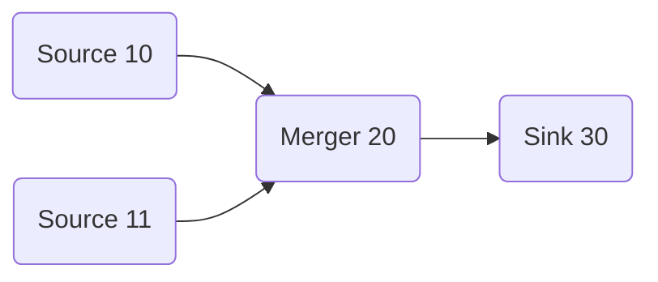

[](LICENSE)

# uGraph

Header‑only C++17 utilities for *static* direct acyclic graphs:

* `Topology` – compile‑time topological ordering & cycle detection (no storage, no allocations)
* `Graph` – runtime traversal + minimal reusable buffer slot assignment

Single include:
```cpp
#include <ugraph.hpp>
```

---

## Topology

Provides compile‑time:
* Topological sorting
* Cycle detection
* Ordered visitation

### NodeTag

Pure type descriptor:

```cpp
NodeTag<ID, Payload, Priority = 0>
```

Encodes a stable integer ID plus a payload (module) type—no runtime object required.

Optional priority parameter:

* `Priority` (default `0`) is a compile-time tie-breaker used by ordering algorithms — larger values run earlier when multiple nodes are otherwise unordered.

### Link

```cpp
Link<Src, Dst>
```

Declares a dependency: `Src` must come before `Dst`. Collect links as template parameters of `Topology`.

### Example

Enforcing subsystem startup order at compile time:

```cpp
// Subsystems
struct Config    { static void init() { /* load config */ } };
struct Logger    { static void init() { /* needs Config */ } };
struct Database  { static void init() { /* needs Config + Logger */ } };
struct HttpServer{ static void init() { /* needs Database */ } };

// IDs
using config_t   = ugraph::NodeTag<1, Config>;
using server_t   = ugraph::NodeTag<2, HttpServer>;
using database_t = ugraph::NodeTag<3, Database>;
using logger_t   = ugraph::NodeTag<4, Logger>;

// Dependencies (Src -> Dst)
using AppTopo =
ugraph::Topology<
    ugraph::Link<config_t,   logger_t>,   // Config before Logger
    ugraph::Link<config_t,   database_t>, // Config before Database
    ugraph::Link<logger_t,   database_t>, // Logger before Database
    ugraph::Link<database_t, server_t>    // Database before Server
>;

static_assert(!AppTopo::is_cyclic());
constexpr auto order = AppTopo::ids(); // e.g. {1,4,3,2}
static_assert(AppTopo::size() == 4);

// Execute in safe order
AppTopo::apply([](auto... tag){
    (decltype(tag)::module_type::init(), ...);
});
```

### Topology API Summary

```cpp
using T = ugraph::Topology</* Links... */>;

static_assert(!T::is_cyclic());          // Detects cycles at compile time
constexpr auto ids    = T::ids();        // std::array of node IDs in order
constexpr auto id0    = T::id_at<0>();   // ID at index
constexpr auto count  = T::size();       // Number of distinct nodes

T::for_each([](auto tag){ /* per tag */ });
auto result = T::apply([](auto... tags){ return sizeof...(tags); });
```

---

## Nested Topology

`ugraph::Topology` supports declaring a `NodeTag` whose `module_type` is itself a `Topology` (a nested topology). The nested topology is flattened at compile time so the parent `Topology` behaves as if the inner nodes were declared directly.

Key points:
- If a `NodeTag`'s `module_type` provides `vertex_types_list_public` and `edges()`, the inner nodes are expanded into the parent's vertex list.
- Edges that reference a module node are expanded using the module's boundary semantics: outer source -> inner module entries, and module exits -> outer destination. Additionally, any edges declared inside the nested module are preserved.

Quick example:

```cpp
using IA = ugraph::NodeTag<1001, A>;
using IB = ugraph::NodeTag<1002, B>;
using IC = ugraph::NodeTag<1003, C>;

using Inner = ugraph::Topology< ugraph::Link<IA, IB>, ugraph::Link<IB, IC> >;
using NestedNode = ugraph::NodeTag<2000, Inner>;
using X = ugraph::NodeTag<3001, A>;

// Outer topology that references the nested module
using Outer = ugraph::Topology< ugraph::Link<NestedNode, X>, ugraph::Link<X, NestedNode> >;

// At compile time `Outer` is equivalent to declaring the inner nodes and edges directly:
// IA -> IB -> IC -> 3001 -> IA
```

Use `Topology::vertex_types_list_public` and `Topology::edges()` on nested module types to inspect the flattened result.


## Graph

Builds a *runtime* data-graph of nodes with:
* Compile‑time cycle detection and ordering (reuses Topology logic)
* Port-aware dataflow traversal
* Minimal buffer “slot” reuse via interval coloring (computes the minimum number of data instances needed for the pipeline)

### Defining Runtime Nodes

```cpp
// User modules expose a `Manifest` describing their IO counts.
struct Source {
    using Manifest = ugraph::Manifest< ugraph::IO<int, 0, 1> >; // 0 in, 1 out
    void process(ugraph::NodeContext<Manifest>&) {}
};

struct Merger {
    using Manifest = ugraph::Manifest< ugraph::IO<int, 2, 1> >; // 2 in, 1 out
    void process(ugraph::NodeContext<Manifest>&) {}
};

struct Sink {
    using Manifest = ugraph::Manifest< ugraph::IO<int, 1, 0> >; // 1 in, 0 out
    void process(ugraph::NodeContext<Manifest>&) {}
};

Source src;
Merger merger;
Sink sink;

// Construct strongly-typed node wrappers using `make_node<id>(module)`.
// The helper deduces the module's `Manifest` and returns a `Node` instance.
auto nSrc   = ugraph::make_node<10>(src);
auto nMerger= ugraph::make_node<20>(merger);
auto nSnk   = ugraph::make_node<30>(sink);

// Connect ports to form the dataflow graph
auto g = ugraph::Graph(
    nSrc.output<int>() >> nMerger.input<int, 0>(),
    nSrc.output<int>() >> nMerger.input<int, 1>(),
    nMerger.output<int>() >> nSnk.input<int>()
);
```

### Executing the Pipeline

```cpp
// Run each module's processing function. `for_each` provides both
// the module instance and its `NodeContext` so you can access inputs/outputs.
g.for_each([](auto& module, auto& ctx){
    module.process(ctx);
});
```

---

### Graph printing

Lightweight helpers produce a mermaid-compatible flowchart for a `Topology` or `Graph`.

Include the headers via the single-include `ugraph.hpp`, then call:

```cpp
// Member helpers (simple):
g.print(std::cout, "MyGraph");
g.print_pipeline(std::cout, "MyPipeline");
```

The output is wrapped in a fenced mermaid block suitable for embedding in Markdown.



### Strict Connections

By default `ugraph::IO` enforces "strict" connections at compile time. The `IO` template accepts a fourth boolean parameter which enables or disables strict checking:

```cpp
// signature: IO<T, in, out, strict=true>
using Manifest = ugraph::Manifest< ugraph::IO<MyType, 1, 0> >; // strict by default
using Optional = ugraph::Manifest< ugraph::IO<MyType, 1, 0, false> >; // opt-out
```

When `strict` is `true` the `Graph` will `static_assert` during construction if required inputs or outputs for that type are not connected. Use `false` to allow optional/unconnected ports.

This compile-time enforcement helps catch wiring mistakes early in pipelines.

## Core Concepts

| Concept        | Type                          | Purpose                                |
|----------------|-------------------------------|----------------------------------------|
| Compile-time id| `NodeTag<ID, Module>`         | ID + payload type (no storage)         |
| Runtime node   | `Node<ID, Module, In, Out>`   | Wraps user instance + port counts      |
| Edge (link)    | `Link<Src, Dst>`              | Declares ordering dependency           |
| Static graph   | `Topology<Link...>`           | Ordering, cycle check, visitation      |
| Runtime view   | `Graph<Link...>`          | Traversal + minimal buffer slot reuse  |

---

## Use Cases

* Deterministic subsystem / service initialization
* Static registration or constexpr table generation
* Fixed processing pipelines (audio, imaging, robotics, ETL)
* Buffer reuse optimization (greedy interval coloring)
* Compile‑time reflection / dispatch (switch tables, jump tables)
