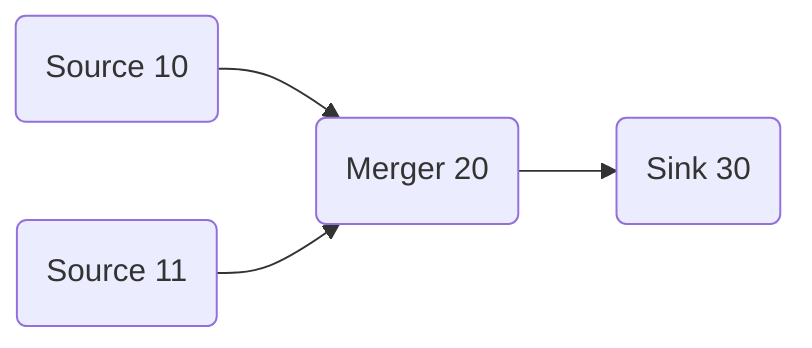

[](LICENSE)

# uGraph

Header‑only C++17 utilities for *static* direct acyclic graphs:

* `Topology` – compile‑time topological ordering & cycle detection (no storage, no allocations)
* `ExternalDataGraph` – runtime traversal + explicit external buffer storage
* `Graph` – owning runtime graph wrapper with built-in buffer storage

Single include:
```cpp
#include <ugraph.hpp>
```

---

## Topology

Provides compile‑time:
* Topological sorting
* Cycle detection
* Ordered visitation

### NodeTag

Pure type descriptor:

```cpp
NodeTag<ID, Payload, Priority = 0>
```

Encodes a stable integer ID plus a payload (module) type—no runtime object required.

Optional priority parameter:

* `Priority` (default `0`) is a compile-time tie-breaker used by ordering algorithms — larger values run earlier when multiple nodes are otherwise unordered.

### Example

Enforcing subsystem startup order at compile time:

```cpp
// Subsystems
struct Config    { static void init() { /* load config */ } };
struct Logger    { static void init() { /* needs Config */ } };
struct Database  { static void init() { /* needs Config + Logger */ } };
struct HttpServer{ static void init() { /* needs Database */ } };

// IDs
using config_t   = ugraph::NodeTag<1, Config>;
using server_t   = ugraph::NodeTag<2, HttpServer>;
using database_t = ugraph::NodeTag<3, Database>;
using logger_t   = ugraph::NodeTag<4, Logger>;

// Dependencies (Src -> Dst)
using AppTopo =
ugraph::Topology<
    std::pair<config_t,   logger_t>,   // Config before Logger
    std::pair<config_t,   database_t>, // Config before Database
    std::pair<logger_t,   database_t>, // Logger before Database
    std::pair<database_t, server_t>    // Database before Server
>;

static_assert(!AppTopo::is_cyclic());
constexpr auto order = AppTopo::ids(); // e.g. {1,4,3,2}
static_assert(AppTopo::size() == 4);

// Execute in safe order
AppTopo::apply([](auto... tag){
    (decltype(tag)::module_type::init(), ...);
});

// Or
AppTopo::for_each([](auto tag){ 
    decltype(tag)::module_type::init();
});
```

### Topology API Summary

```cpp
using T = ugraph::Topology</* Links... */>;

static_assert(!T::is_cyclic());          // Detects cycles at compile time
constexpr auto ids    = T::ids();        // std::array of node IDs in order
constexpr auto id0    = T::id_at<0>();   // ID at index
constexpr auto count  = T::size();       // Number of distinct nodes

T::for_each([](auto tag){ /* per tag */ });
auto result = T::apply([](auto... tags){ return sizeof...(tags); });
```

---

## Graph

Builds a *runtime* data-graph of nodes with:
* Compile‑time cycle detection and ordering (reuses Topology logic)
* Port-aware dataflow traversal
* Minimal buffer “slot” reuse via interval coloring (computes the minimum number of data instances needed for the pipeline)

There are two runtime graph flavors:

* `ugraph::ExternalDataGraph<...>` stores graph structure and contexts, but takes its `graph_data_t` explicitly through `init(graphData)`.
* `ugraph::Graph<...>` inherits from `ExternalDataGraph`, owns its `graph_data_t`, and calls `init(...)` automatically during construction.

### Defining Runtime Nodes

```cpp
// User modules expose a `Manifest` describing their IO counts.
struct Source {

    using Manifest = 
        ugraph::Manifest<
            ugraph::IO<int, 0, 1> // 0 in, 1 out
        >;

    void process(ugraph::Context<Manifest>& ctx) {
        ctx.output<int>() = 5;
    }
};

struct Merger {

    using Manifest = 
        ugraph::Manifest<
            ugraph::IO<int, 2, 1> // 2 in, 1 out
        >;

    void process(ugraph::Context<Manifest>& ctx) {
        
        ctx.output<int>() = ctx.input<int>(0) + ctx.input<int>(1);

        // or
        // int out = 0;
        // for(const auto& i : ctx.inputs<int>()) {
        //     out += i;
        // }
        // ctx.output<int>() = out;
    }
};

struct Sink {

    using Manifest = 
        ugraph::Manifest<
            ugraph::IO<int, 1, 0> // 1 in, 0 out
        >;

    void process(ugraph::Context<Manifest>& ctx) {
        std::cout << ctx.input<int>();
    }

};

Source src;
Merger merger;
Sink sink;

// Construct strongly-typed node wrappers using `make_node<id>(module)`.
// The helper deduces the module's `Manifest` and returns a `Node` instance.
auto nSrc   = ugraph::make_node<10>(src);
auto nMerger= ugraph::make_node<20>(merger);
auto nSnk   = ugraph::make_node<30>(sink);

// Connect ports to form the dataflow graph
auto g = ugraph::Graph(
    nSrc.output<int>() >> nMerger.input<int, 0>(),
    nSrc.output<int>() >> nMerger.input<int, 1>(),
    nMerger.output<int>() >> nSnk.input<int>()
);

// Graph-owned storage is initialized during construction.
// Access the owned storage when you need to seed buffer-backed values.
auto& graphData = g.graph_data();

using graph_t = decltype(g);
static_assert(graph_t::graph_data_t::template count<int>() == 2);
graphData.template slot<int>(0) = 5;
```

### Shared External Storage

Use `ExternalDataGraph` when multiple graph instances should reuse the same `graph_data_t`.

```cpp
using shared_graph_t = ugraph::ExternalDataGraph<
    decltype(nSrc.output<int>() >> nMerger.input<int, 0>()),
    decltype(nSrc.output<int>() >> nMerger.input<int, 1>()),
    decltype(nMerger.output<int>() >> nSnk.input<int>())
>;

shared_graph_t::graph_data_t sharedData;

auto g0 = shared_graph_t(
    nSrc.output<int>() >> nMerger.input<int, 0>(),
    nSrc.output<int>() >> nMerger.input<int, 1>(),
    nMerger.output<int>() >> nSnk.input<int>()
);

auto g1 = shared_graph_t(
    nSrc.output<int>() >> nMerger.input<int, 0>(),
    nSrc.output<int>() >> nMerger.input<int, 1>(),
    nMerger.output<int>() >> nSnk.input<int>()
);

g0.init(sharedData);
g1.init(sharedData);
```

After `init(sharedData)`, the graph contexts point into the provided storage. `ExternalDataGraph` does not own or retain a separate data instance.

`graph_data_t` exposes typed slot access:

```cpp
sharedData.template slot<int>(0) = 12;
auto& allIntSlots = sharedData.template slots<int>();
static_assert(shared_graph_t::graph_data_t::template count<int>() == 2);
```

### Executing the Pipeline

```cpp
// Run each module's processing function. `for_each` provides both
// the module instance and its `Context` so you can access inputs/outputs.
g.for_each([](auto& module, auto& ctx){
    module.process(ctx);
});
```

---

### Graph printing

Lightweight helpers produce a mermaid-compatible flowchart for a `Topology` or `Graph`.

Include the headers via the single-include `ugraph.hpp`, then call:

```cpp
// Graph member helper:
g.print(std::cout, "MyGraph");

// Free helper for pipeline-style rendering:
ugraph::print_pipeline<decltype(g)>(std::cout, "MyPipeline");
```

The output is wrapped in a fenced mermaid block suitable for embedding in Markdown.


```mermaid
flowchart LR
10(Source 10)
11(Source 11)
20(Merger 20)
30(Sink 30)
10 --> 20
11 --> 20
20 --> 30
```

### Strict Connections

By default `ugraph::IO` enforces "strict" connections at compile time. The `IO` template accepts a fourth boolean parameter which enables or disables strict checking:

```cpp
// signature: IO<T, in, out, strict=true>
using Manifest = ugraph::Manifest< ugraph::IO<MyType, 1, 0> >; // strict by default
using Optional = ugraph::Manifest< ugraph::IO<MyType, 1, 0, false> >; // opt-out
```

Every `ugraph::Graph` construction performs a compile-time wiring check. Required inputs and outputs must be satisfied through graph edges or constructor-time data bindings, otherwise graph construction fails with a `static_assert`.

The `strict` flag controls which ports participate in that check:

- `strict == true`: the spec must be wired according to the graph rules.
- `strict == false`: the spec is treated as optional and does not make the graph fail the compile-time completeness check.

This compile-time enforcement helps catch wiring mistakes early in pipelines.


#### Construction-time external IO binding

If a node needs external inputs or outputs, bind them as part of the graph definition.

```cpp
// bind external storage directly in the graph definition
int inData = 0;
float outData = 0;

auto graph = ugraph::Graph(
    inData | entryNode.input<int>(),
    entryNode.output<int>() >> outputNode.input<int>(),
    outputNode.output<float>() | outData
);
```

- Or run a single module manually by constructing a `Context` and calling `set_ios` to point its input/output storage:

```cpp
using manifest_t = Manifest<
    IO<int, 2, 1>
>;
ugraph::Context<manifest_t> ctx;
int inData1, inData2;
int outData;
ctx.set_ios(std::array{ &inData1, &inData2, &outData });
```

These options let you supply or capture data for nodes that are intentionally left unconnected in the graph.


## Core Concepts

| Concept        | Type                                   | Purpose                               |
|----------------|----------------------------------------|---------------------------------------|
| Compile-time id| `NodeTag<ID, Module, Priority>`        | ID + payload type (no storage)        |
| Runtime node   | `Node<ID, Module, Manifest, Priority>` | Wraps user instance + port counts     |
| Static graph   | `Topology<Edges...>`                   | Ordering, cycle check, visitation     |
| External-storage graph | `ExternalDataGraph<Edges...>` | Traversal + explicit external storage |
| Owning runtime graph | `Graph<Edges...>`                | ExternalDataGraph + owned storage     |

---

## Use Cases

* Deterministic subsystem / service initialization
* Static registration or constexpr table generation
* Fixed processing pipelines (audio, imaging, robotics, ETL)
* Buffer reuse optimization (greedy interval coloring)
* Compile‑time reflection / dispatch (switch tables, jump tables)
